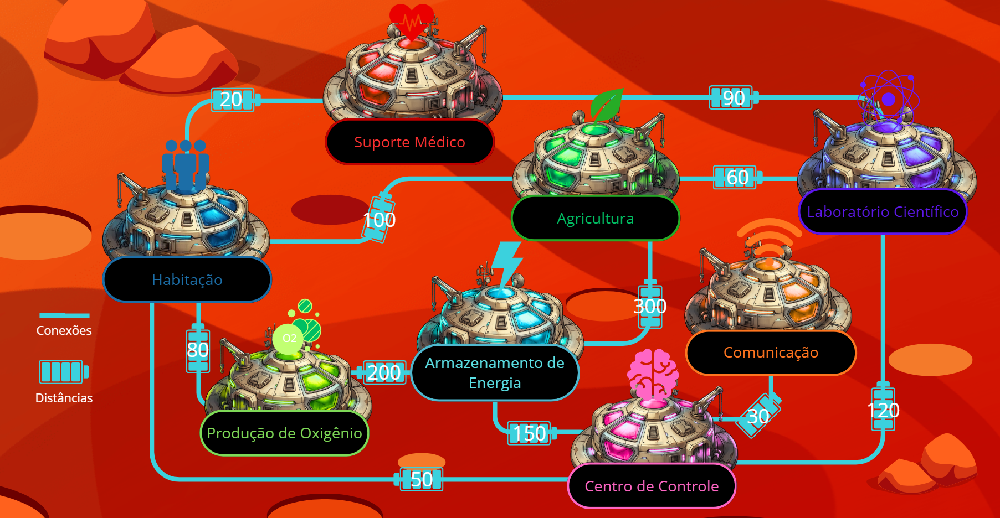

---

# SIGIC – Sistema Inteligente de Gerenciamento da Infraestrutura da Colônia

## 1. Visão Geral do Projeto

O SIGIC (Sistema Inteligente de Gerenciamento da Infraestrutura da Colônia) é um sistema desenvolvido em Python para representar e analisar a infraestrutura de uma colônia baseada em módulos interconectados.

O objetivo principal é modelar a rede da colônia como um grafo ponderado, permitindo a análise de conexões, consumo energético, criticidade dos módulos e otimização de rotas utilizando algoritmos de teoria dos grafos.

---

## 2. Organização da Infraestrutura da Colônia

A colônia é composta por diferentes módulos operacionais:

### Habitação
* Consumo Energético: 120 kWh

* Prioridade Operacional: 2 

* Capacidade de Armazenamento: 500 kWh / 1000L Água

* Necessidade de Comunicação: Média

* Status: Ativo

* Conexões: Centro de controle (50m), Suporte médico (20m), Produção de oxigênio (80m), Agricultura (100m)

### Centro de Controle
* Consumo Energético: 85 kWh

* Prioridade Operacional: 1 (Crítica)

* Capacidade de Armazenamento: Servidores / Nobreaks

* Necessidade de Comunicação: Altíssima

* Status: Ativo

* Conexões: Habitação (50m), Comunicação (30m), Armazenamento de energia (150m), Laboratório científico (120m)

### Armazenamento de Energia
* Consumo Energético: 15 kWh

* Prioridade Operacional: 1 (Crítica)

* Capacidade de Armazenamento: 50.000 kWh

* Necessidade de Comunicação: Média

* Status: Ativo

* Conexões: Centro de controle (150m), Produção de oxigênio (200m), Agricultura (300m)
  
### Agricultura
* Consumo Energético: 250 kWh

* Prioridade Operacional: 3

* Capacidade de Armazenamento: Estufas / Água

* Necessidade de Comunicação: Baixa

* Status: Ativo

* Conexões: Habitação (100m), Armazenamento de energia (300m), Laboratório científico (60m)
  
### Laboratório Científico
* Consumo Energético: 180 kWh

* Prioridade Operacional: 4

* Capacidade de Armazenamento: Amostras / Câmaras criogênicas

* Necessidade de Comunicação: Alta

* Status: Ativo

* Conexões: Centro de controle (120m), Agricultura (60m), Suporte médico (90m)

### Comunicação
* Consumo Energético: 95 kWh

* Prioridade Operacional: 2

* Capacidade de Armazenamento: Terabytes

* Necessidade de Comunicação: Altíssima

* Status: Ativo

* Conexões: Centro de controle (30m)
  
### Suporte Médico
* Consumo Energético: 60 kWh

* Prioridade Operacional: 1 (Crítica)

* Capacidade de Armazenamento: Suprimentos médicos

* Necessidade de Comunicação: Média

* Status: Ativo

* Conexões: Habitação (20m), Laboratório científico (90m)
  
### Produção de Oxigênio
* Consumo Energético: 300 kWh

* Prioridade Operacional: 1 (Crítica)

* Capacidade de Armazenamento: Tanques O2

* Necessidade de Comunicação: Baixa

* Status: Ativo

* Conexões: Habitação (80m), Armazenamento de energia (200m)

---

## 3. Estruturas de Dados Utilizadas

### 3.1 Dicionários

A estrutura principal da colônia é representada por um dicionário Python, onde cada chave representa um módulo e seus atributos.

---

### 3.2 Listas

Utilizadas para armazenar:

* conexões entre módulos
* lista de módulos da colônia

---

### 3.3 Tuplas

As conexões são representadas por tuplas no formato:

(módulo_destino, distância)

Exemplo:
("Centro de controle", 50)

---

## 4. Representação em Grafo


*A imagem é desproporcional e meramente ilustrativa*
---

## 5. Algoritmos Implementados

### 5.1 BFS (Busca em Largura)

Utilizado para explorar todos os módulos da colônia de forma nivelada, analisando conectividade geral da rede.

Aplicações:

* Fazer mapeamento da rede por níveis

---

### 5.2 DFS (Busca em Profundidade)

Utilizado para explorar caminhos profundos da rede, percorrendo conexões de forma recursiva.

Aplicações:

* Fazer inspeção da infraestrutura da rede

---

### 5.3 Dijkstra (Otimização de Rotas)

Utilizado para encontrar o caminho mais otimizado em relação ao peso

Aplicações:

* Busca o caminho mais curto, para uma passagem de energia otimizada
---

## 6. Modelagem Matemática

Foi implementado um modelo matemático para simular a perda de energia na transmissão entre módulos.

### Fórmula utilizada:

E(d) = E₀ × e^(-0.002 × d)

Onde:

* E(d) = energia recebida
* E₀ = energia inicial
* d = distância entre os módulos
* 0.002 = coeficiente de perda energética

### Análise:

O modelo representa a perda exponencial de energia ao longo da distância, simulando eficiência real de transmissão em redes energéticas.

---

## 7. Otimização da Colônia

A otimização do sistema é realizada através de:

* cálculo de menor caminho (Dijkstra)
* análise de criticidade dos módulos
* avaliação de consumo energético
* exploração da rede (BFS e DFS)

Isso permite identificar rotas mais eficientes e módulos mais críticos para a operação da colônia.

---

## 8. Funcionalidades do Sistema

O sistema possui um menu interativo com as seguintes funções:

* Consultar módulos da colônia
* Executar modelagem matemática
* Calcular menor caminho (Dijkstra)
* Executar BFS (exploração da rede)
* Executar DFS (exploração profunda)

---

## 9. Arquitetura do Projeto

```
SIGIC_Project/
 |-- arquivos_auxiliares/
 |    |-- Colônia-AURORA-SIGER.png
 |-- docs/
 |    |-- documentacao_complementar.pdf
 |    |-- rede_colonia.pdf
 |-- .gitignore
 |-- codigo_fonte.py (Sistema unificado)
 |-- README.md

```

---

## 10. Conclusão

O SIGIC integra conceitos fundamentais de estruturas de dados, grafos e otimização computacional para simular o gerenciamento inteligente de uma infraestrutura crítica.

O sistema permite análise da rede, otimização de caminhos e modelagem matemática aplicada, demonstrando a aplicação prática dos conceitos estudados na disciplina.

---

## 11. Sustentabilidade e Governança da Infraestrutura
A viabilidade a longo prazo da Colônia Aurora Siger não se sustenta apenas na robustez de sua engenharia física, mas também na aplicação prática dos pilares ESG (Ambiental, Social e Governança) integrados à teoria dos grafos. O SIGIC foi estruturado sob a ótica das Redes Inteligentes (Smart Grids), garantindo que a sobrevivência humana em um ambiente de escassez extrema ocorra com o máximo de eficiência e rastreabilidade.

### 11.1 Pilar Ambiental: Uso Sustentável e Redução de Perdas
A arquitetura de rede da colônia foi desenhada visando a redução implacável do desperdício nas linhas de transmissão. O sistema utiliza a modelagem matemática de decaimento exponencial $E(d) = E_0 \times e^{-0.002 \cdot d}$ para calcular as perdas ao longo das distâncias (pesos das arestas).
Para combater esse desperdício físico:

* Alocação Estratégica: Módulos de alta demanda, como a Produção de Oxigênio (300 kWh) e a Agricultura (250 kWh), possuem arestas calculadas para minimizar o trajeto até os centros de distribuição, reduzindo a dissipação térmica.

* Armazenamento BESS: A colônia não depende de fontes intermitentes instáveis. O nó central de Armazenamento de Energia, operando com baixo consumo próprio (15 kWh), abriga um robusto sistema BESS (Battery Energy Storage System) de 50.000 kWh. Ele atua como o pulmão da Smart Grid, absorvendo variações de carga e impedindo o desperdício de carga excedente.

### 11.2 Pilar Social: Sobrevivência e Priorização Automatizada
No contexto espacial, o impacto "Social" se reflete diretamente na garantia da vida humana. A gestão energética não é engessada; ela reage dinamicamente baseada nos algoritmos de busca implementados.

Através do atributo "prioridade_operacional" definido na nossa estrutura de dicionários, o algoritmo de otimização (Dijkstra) sabe como agir em cenários de crise:

* Em uma falha em cascata, a gestão automatizada corta o roteamento para módulos de suporte secundário, como o Laboratório Científico (Prioridade 4) e a Agricultura (Prioridade 3).

* Simultaneamente, o fluxo energético é blindado e redirecionado para os módulos de Prioridade 1 (Centro de Controle, Armazenamento, Suporte Médico e Produção de O2), garantindo que os sistemas de suporte à vida e as comunicações críticas não sofram apagões.

### 11.3 Pilar de Governança: Transparência e Expansão Tecnológica

A governança algorítmica exige que os sistemas computacionais não sejam sistemas opacos.

* Rastreabilidade de Fluxo: O uso de algoritmos de percurso (BFS e DFS) permite que qualquer decisão tomada pelo SIGIC seja rastreável. Se houver um gargalo de distribuição na rede, a varredura DFS consegue mapear exatamente qual ramificação da infraestrutura (lista de adjacência) causou a falha, permitindo intervenção humana imediata e precisa.

* Crescimento Sustentável: A expansão da Aurora Siger reflete a modularidade do Python. A adição de um novo módulo exige apenas a inserção de uma nova chave no dicionário. Contudo, a gestão automatizada determina que nenhuma expansão física seja acoplada à rede sem que a arquitetura de rede passe antes pelas simulações matemáticas do SIGIC. Isso garante que novos nós não sobrecarreguem o custo de transmissão das arestas já existentes.

## 12. Conclusão Final

O SIGIC vai além de uma simples representação de dados. Ao unificar Estruturas de Dados em Python (Dicionários, Tuplas e Listas), Algoritmos de Grafos (Dijkstra, BFS, DFS) e Cálculo Diferencial (modelagem de perdas), o sistema entrega uma prova de conceito completa de uma governança espacial autônoma. O projeto demonstra que a sustentabilidade de uma colônia em marte depende de decisões orientadas a dados, evidenciando que a precisão matemática no cálculo das rotas e a redução do desperdício são a verdadeira garantia para a continuidade da missão.

## 13. Demonstração do SIGIC em Funcionamento

[](https://youtu.be/sbAo-NdrKw4)
